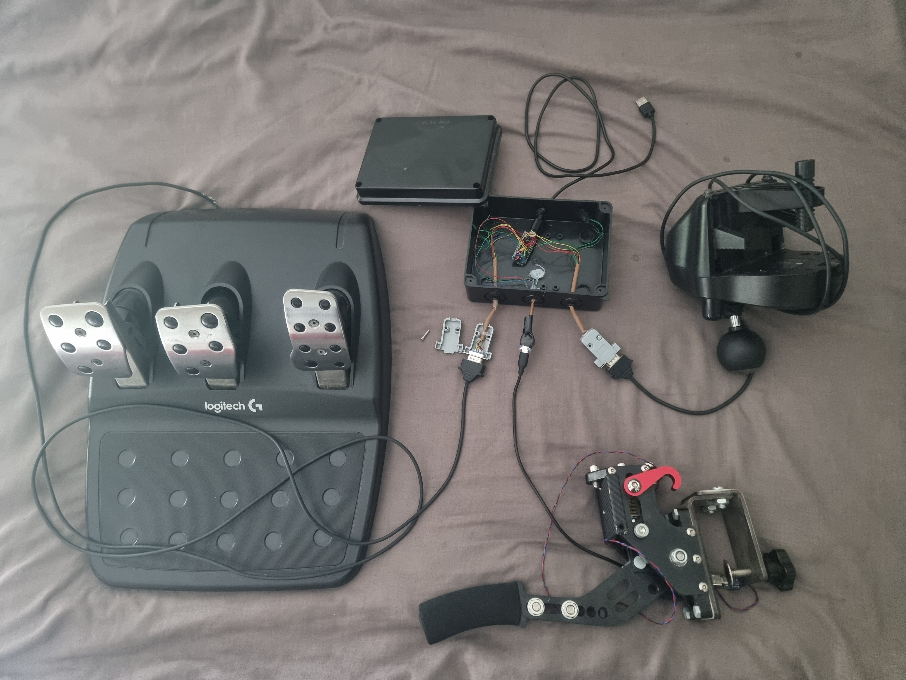
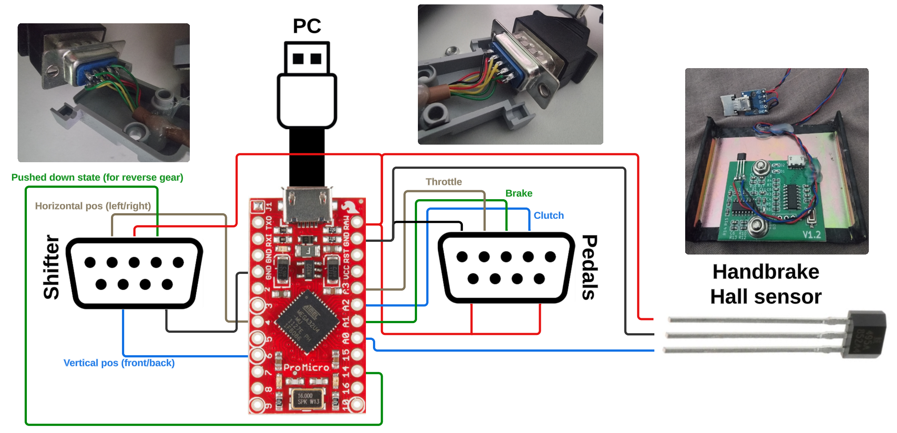
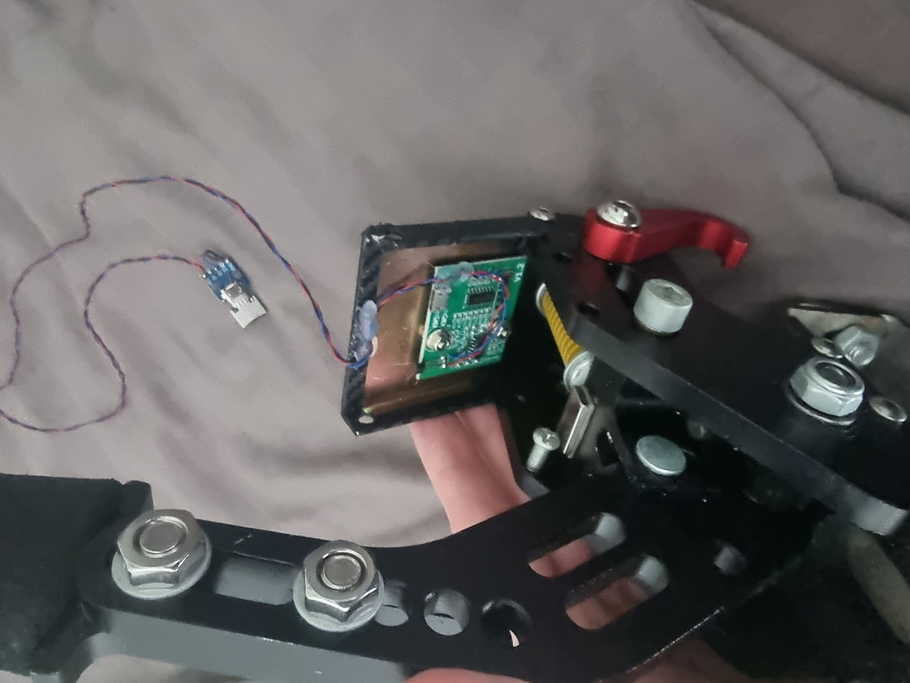
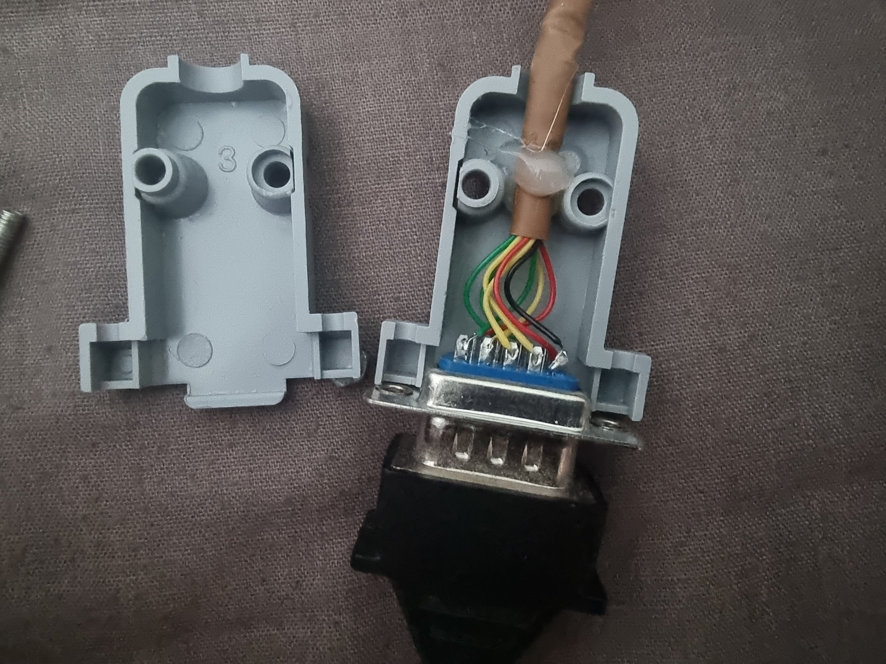
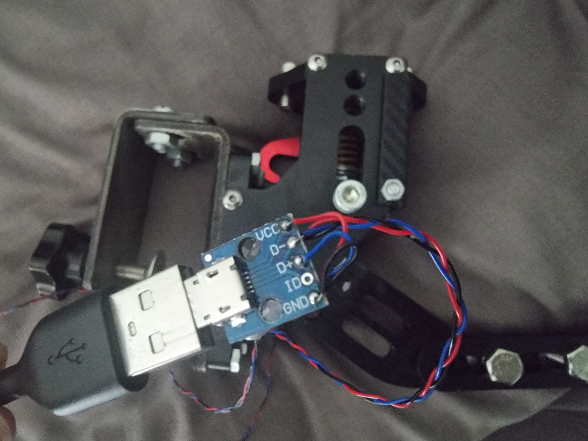
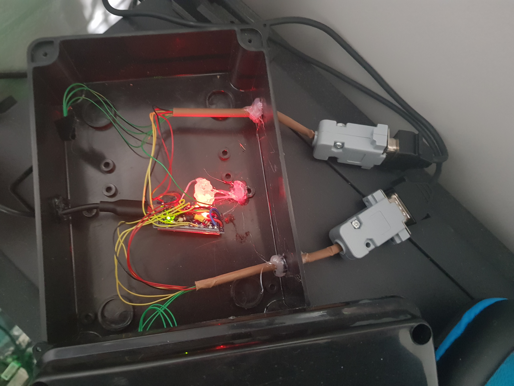

# sim_racing_arduino_controller

This sketch programs Arduino Pro Micro microcontroller to read Logitech pedals, Logitech shifter, and a handbrake as analog input pins. After programming, the microcontroller acts as a controller for sim racing games on PC (it works in all modern games like Assetto Corsa, ACC, iRacing, Forza Horizon 5, BeamNG, F1 23).

A nice feature of this setup is that a single USB connector provides the following inputs to a PC:
* pedals
* shifter
* handbrake
* potentially any other buttons (to add large number of buttons we could use a shift register)

You can see that on images, RS232 connectors have more wires than in the schematics, these are unused and can be ignored (they were connected during testing).

The latency of devices is around 35-40ms as measured during this test:  
https://www.youtube.com/watch?v=JN2piJnbTjY  
  
The sketch is using the ArduinoJoystickLibrary (tested with version 2.1.1):   
https://github.com/MHeironimus/ArduinoJoystickLibrary  

